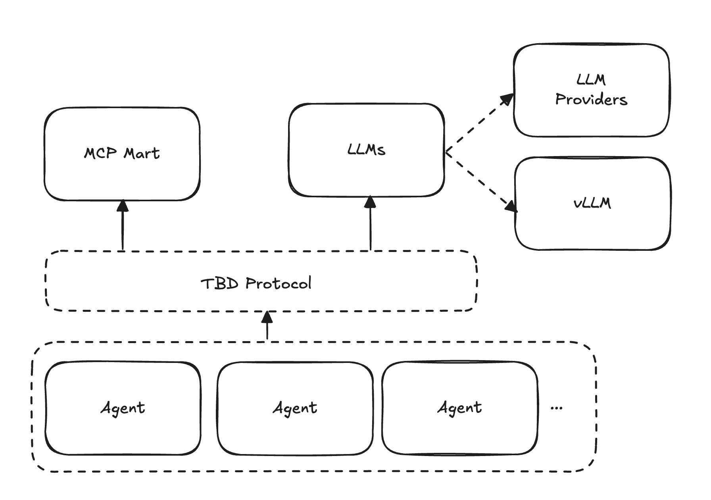

# 겔리메르(Gelimer)

**Gelimer**는 Kubernetes 환경에서 LLM(Large Language Model) 서빙과 AI Agent를 관리하는 Kubernetes Operator입니다.

## 🏗️ 아키텍처

Gelimer는 다음과 같은 주요 컴포넌트로 구성됩니다:

### 핵심 컴포넌트
- **LLM CRD**: vLLM을 통한 LLM 모델 서빙 또는 외부 LLM Provider 연결을 담당
- **MCP Mart**: 등록된 MCP(Model Context Protocol)와 Agent 간의 연결을 관리
- **Agent**: LangGraph 또는 커스텀으로 생성된 AI Agent를 의미
- **Operator**: 모든 컴포넌트의 생명주기를 관리하는 Kubernetes Controller

## ✨ 주요 기능

- **🚀 LLM 모델 서빙**: vLLM을 통한 고성능 LLM 모델 서빙
- **⚙️ 유연한 구성**: 상세한 vLLM 런타임 설정 지원 (병렬 처리, 캐시, LoRA 등)
- **🔧 Kubernetes 네이티브**: CRD를 통한 선언적 구성 관리
- **📊 모니터링**: Prometheus 메트릭 및 상태 관리
- **🔐 보안**: RBAC 및 ServiceAccount 기반 권한 관리

## 🔗 관련 링크

- [vLLM Documentation](https://docs.vllm.ai/)
- [Kubernetes Operator Pattern](https://kubernetes.io/docs/concepts/extend-kubernetes/operator/)
- [Kubebuilder](https://book.kubebuilder.io/)
